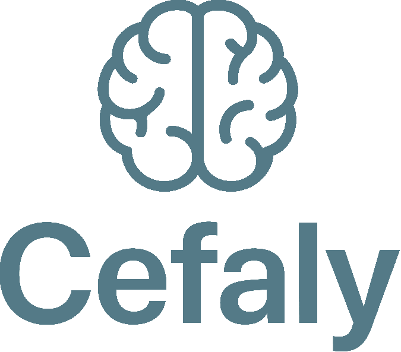

<div align="center">
    

  <p align="center">
    Um aplicativo móvel para registrar, acompanhar e analisar episódios de cefaleia.
  </p>
</div>

### Sumário
1. [Funcionalidades do MVP](#funcionalidades-básicas-para-um-mvp)
1. [Funcionalidades Futuras](#funcionalidades-adicionais-para-checkpoints-futuros)
1. [Protótipos](#protótipos)
1. [Modelagem do Banco](#modelagem-do-banco)
1. [Planejamento](#planejamento)
1. [Tecnologias Utilizadas](#tecnologias-utilizadas)

Este aplicativo foi pensado para ser uma ferramenta de apoio para pessoas que sofrem com enxaquecas ou dores de cabeça no geral. A motivação para o desenvolvimento surgiu da minha própria experiência com **cefaleia em salvas**, um tipo de dor bem intensa e debilitante que ocorre em episódios regulares [(Manual MSD)](https://www.msdmanuals.com/pt/casa/dist%C3%BArbios-cerebrais-da-medula-espinal-e-dos-nervos/cefaleias/cefaleias-em-salvas).

Ao longo do tempo, percebi como é importante manter registro dos episódios — seus gatilhos, intensidade, sintomas e efeitos dos medicamentos — para ajudar tanto no acompanhamento pessoal quanto no suporte ao diagnóstico médico.

### Funcionalidades básicas para um MVP

- [ ] Registrar episódios com:
  - [ ] Data e horário
  - [ ] Intensidade da dor (ex: escala de 1 a 10)
  - [ ] Local da dor na região do crânio
  - [ ] Sintomas associados
  - [ ] Possíveis gatilhos (ex: alimentação, estresse, sono, etc.)
  - [ ] Medicamentos utilizados
  - [ ] Resultado do medicamento (a dor passou ou não)
- [ ] Visualizar histórico dos episódios
- [ ] Editar ou excluir registros
- [ ] Armazenamento local dos dados [(Zustand)](https://zustand.docs.pmnd.rs/getting-started/introduction)
- [ ] Modo escuro

### Funcionalidades adicionais (para checkpoints futuros)

- [ ] Gráficos de frequência e intensidade das crises
- [ ] Notificações para lembrar de registrar crises ou tomar medicamentos
- [ ] Quantidade de dias desde a última ocorrência
- [ ] Exportar histórico em PDF ou CSV

### Protótipos
Os protótipos podem ser acessos neste link:
https://www.figma.com/design/U5ZSicMuBaHga42wSojIEv/Cefaly?node-id=0-1&t=sxuid54mth0i6IMe-1

### Modelagem do banco
```
├── 🗂️ Collection: users
│   └── 📄 Document: {userId}
│       ├── name: string
│       ├── email: string
│       └── createdAt: timestamp
│
├── 🗂️ Collection: episodes
│   └── 📄 Document: {episodeId}
│       ├── userId: string (ref → users/{userId})
│       ├── timestamp: timestamp
│       ├── dayPeriod: string (ex: "manhã", "tarde", "noite")
│       ├── intensity: number (1–10)
│       ├── painLocation: string (ex: "frente", "lateral", etc.)
│       ├── symptoms: array<string> (ex: ["náusea", "fotofobia"])
│       ├── triggers: array<string> (ex: ["estresse", "falta de sono"])
│       ├── medication: string
│       ├── medicationOutcome: string (ex: "a dor passou")
│       └── notes: string
│
├── 🗂️ Collection: history
│   └── 📄 Document: {historyId}
│       ├── episodeId: string (ref → episodes/{episodeId})
│       ├── modifiedAt: timestamp
│       └── changes: string (ex: "Atualizado campo intensity de 5 para 7")
```

### Planejamento

Sprint 1 – Planejamento e Infraestrutura (Semana 1)

**Objetivo:** Estabelecer as bases do projeto e definir o escopo mínimo viável.

- Definição dos requisitos do MVP
- Escolha e documentação do Design System (cores, tipografia, componentes)
- Criação do repositório no GitHub e organização da estrutura inicial
- Configuração do ambiente com **Expo + React Native**

---

Sprint 2 – Autenticação e Navegação (Semana 2)

**Objetivo:** Implementar o fluxo de login/registro e a estrutura de navegação.

- Tela de Boas-Vindas
- Telas de Login e Registro com Firebase Authentication
- Navegação com React Navigation (Stack e Bottom Tabs)
- Middleware para proteger rotas privadas

---

Sprint 3 – Registro de Episódio (Semana 3)

**Objetivo:** Desenvolver o formulário de registro de crises de enxaqueca.

- Tela de "Novo Episódio"
- Campos: data/hora, intensidade, localização da dor, período do dia, sintomas, gatilhos, medicação, resultado da medicação, observações
- Validação e usabilidade dos campos
- Salvamento dos dados no Firestore, com referência ao `userId`

---

Sprint 4 – Dashboard e Histórico (Semana 4)

**Objetivo:** Exibir informações registradas pelo usuário.

- Tela Home / Dashboard:
  - Resumo do último episódio
  - Atalhos para registrar novo episódio
- Tela de Histórico de Episódios:
  - Listagem dos episódios com informações resumidas
- Leitura dos dados armazenados no Firestore

---

Sprint 5 – Edição e Histórico de Alterações (Semana 5)

**Objetivo:** Permitir que o usuário visualize, edite e acompanhe modificações nos registros.

- Tela de detalhes de um episódio
- Edição dos dados registrados
- Criação/atualização de documentos na coleção `history` com cada alteração
- Registro da data e descrição da modificação

---

Sprint 6 – Refinamento, Testes e Apresentação (Semana 6)

**Objetivo:** Finalizar o MVP com estabilidade, testes e ajustes de experiência do usuário.

- Melhorias visuais conforme Design System
- Testes de usabilidade e correções de bugs
- Revisão de fluxo de navegação
- Ajustes de performance e responsividade
- Preparação para demonstração/apresentação final do app


## Tecnologias utilizadas

- React Native (Expo)
- TypeScript
